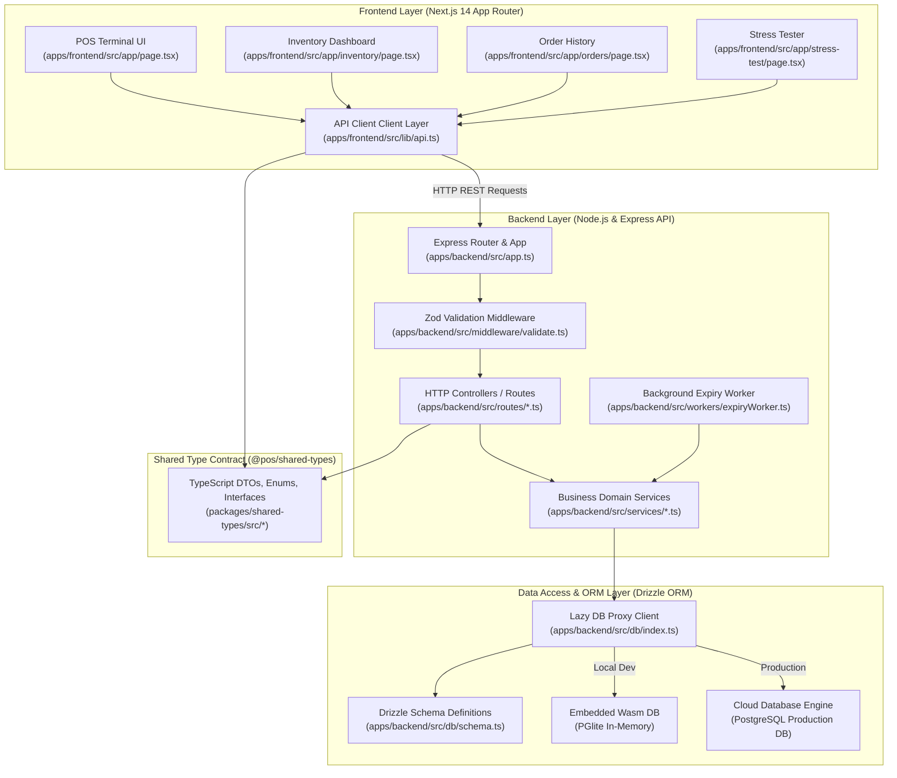
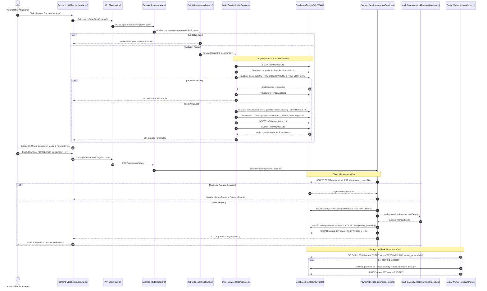
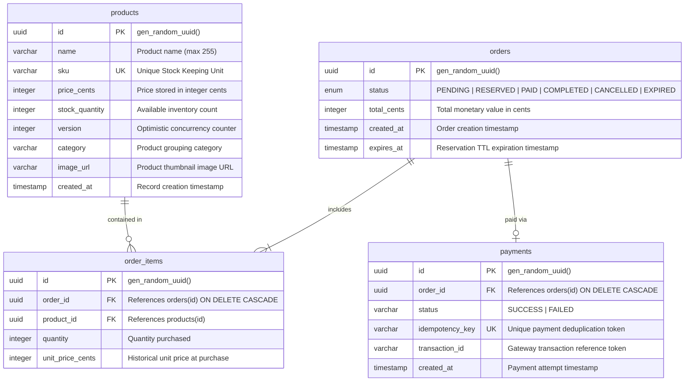

# 🛍️ Point of Sale (POS) & Inventory Management System
## Master Architecture & Interview Preparation Guide

> **Target Audience**: Technical Interviewers, System Architects, Senior Software Engineers.  
> **Repository**: `pos-order-inventory-system`  
> **Tech Stack**: TypeScript, Node.js/Express, Next.js 14 App Router, TailwindCSS, Drizzle ORM, PostgreSQL / PGlite (Wasm DB), Zod, pnpm Workspaces.

---

## 📋 Table of Contents
1. [Executive Summary & Problem Statement](#-executive-summary--problem-statement)
2. [Visual Architecture Diagrams (Mermaid)](#-visual-architecture-diagrams-mermaid)
   - [High-Level System Architecture](#1-high-level-system-architecture)
   - [End-to-End POS Order & Checkout Sequence Diagram](#2-end-to-end-pos-order--checkout-sequence-diagram)
   - [Database Entity-Relationship (ER) Diagram](#3-database-entity-relationship-er-diagram)
3. [Folder Structure & Comprehensive File-by-File Guide](#-folder-structure--comprehensive-file-by-file-guide)
   - [Workspace Root](#workspace-root)
   - [`packages/shared-types`](#packagesshared-types)
   - [`apps/backend`](#appsbackend)
   - [`apps/frontend`](#appsfrontend)
   - [`apps/Doc`](#appsdoc)
4. [Complete End-to-End Dataflow Deep Dive](#-complete-end-to-end-dataflow-deep-dive)
   - [Step 1: User Action (React Frontend UI)](#step-1-user-action-react-frontend-ui)
   - [Step 2: HTTP Transport & Network Execution](#step-2-http-transport--network-execution)
   - [Step 3: Route Handling & Request Validation (Express & Zod)](#step-3-route-handling--request-validation-express--zod)
   - [Step 4: Business Logic & Transactional Database Execution (Service Layer)](#step-4-business-logic--transactional-database-execution-service-layer)
   - [Step 5: Database Storage & Commit (PostgreSQL / PGlite)](#step-5-database-storage--commit-postgresql--pglite)
   - [Step 6: Idempotent Payment Simulation](#step-6-idempotent-payment-simulation)
   - [Step 7: Background TTL Reservation Expiry Worker](#step-7-background-ttl-reservation-expiry-worker)
5. [Core Computer Science & System Design Concepts (Interview Q&A)](#-core-computer-science--system-design-concepts-interview-qa)
   - [Concept 1: Race Conditions & High-Concurrency Inventory Locks](#concept-1-race-conditions--high-concurrency-inventory-locks)
   - [Concept 2: Deadlock Avoidance by Lock Ordering](#concept-2-deadlock-avoidance-by-lock-ordering)
   - [Concept 3: Two-Phase Inventory Allocation (TTL Soft Locks)](#concept-3-two-phase-inventory-allocation-ttl-soft-locks)
   - [Concept 4: Idempotent API Design](#concept-4-idempotent-api-design)
   - [Concept 5: Dual Database Engine & Proxy Pattern](#concept-5-dual-database-engine--proxy-pattern)
   - [Concept 6: Monorepo Architecture & End-to-End Type Safety](#concept-6-monorepo-architecture--end-to-end-type-safety)

---

## 💡 Executive Summary & Problem Statement

### The Problem
In traditional Point-of-Sale (POS) and e-commerce applications, **inventory over-selling (race conditions)** is a catastrophic problem. When hundreds of users simultaneously attempt to buy a high-demand item with limited stock (e.g., 1 unit remaining), naive implementations perform read-then-write steps (`SELECT stock` -> `if stock > 0` -> `UPDATE stock`), resulting in **negative inventory** and **over-booked orders**. Additionally, uncompleted checkouts lock up inventory indefinitely unless automatically reclaimed.

### The Solution
This POS application implements an **enterprise-grade, ACID-compliant transaction pipeline** featuring:
1. **Pessimistic Row Locking (`SELECT ... FOR UPDATE`)** & **Atomic Decrement Queries** to guarantee 100% thread-safe stock deduction under high concurrency.
2. **Deterministic Lock Ordering** (sorting item IDs before locking) to prevent database deadlocks.
3. **Two-Phase Reservation Pattern**: Inventory is temporarily reserved for 10 minutes (`RESERVED` status). If the payment fails or expires, an asynchronous **TTL Expiry Background Worker** automatically releases stock back into availability.
4. **Idempotent Payment Gateway**: Idempotency keys prevent duplicate credit card charges and double-fulfilled orders during retries or network drops.
5. **Dual Database Mode**: Seamlessly switches between in-memory WebAssembly PostgreSQL (**PGlite**) for zero-config local development/testing and **PostgreSQL Cloud DB** (Supabase/Neon/AWS RDS) for production.

---

## 🎨 Visual Architecture Diagrams (Mermaid)

### 1. High-Level System Architecture



---

### 2. End-to-End POS Order & Checkout Sequence Diagram



---

### 3. Database Entity-Relationship (ER) Diagram



---

## 📁 Folder Structure & Comprehensive File-by-File Guide

Below is an exhaustive reference for every folder and file in this codebase, explaining its single responsibility, architectural pattern, and key exported symbols.

```
pos-order-inventory-system/
├── package.json
├── pnpm-workspace.yaml
├── tsconfig.base.json
├── tsconfig.json
├── INTERVIEW_DOCUMENTATION.md
├── packages/
│   └── shared-types/
│       ├── package.json
│       ├── tsconfig.json
│       └── src/
│           ├── index.ts
│           ├── product.ts
│           ├── order.ts
│           ├── payment.ts
│           └── api.ts
└── apps/
    ├── Doc/
    │   ├── COMMANDS.md
    │   └── POS_Build_Log_TypeScript_Edition.md
    ├── backend/
    │   ├── package.json
    │   ├── tsconfig.json
    │   ├── drizzle.config.ts
    │   ├── .env
    │   └── src/
    │       ├── index.ts
    │       ├── app.ts
    │       ├── db/
    │       │   ├── schema.ts
    │       │   ├── rawTypes.ts
    │       │   ├── index.ts
    │       │   └── seed.ts
    │       ├── errors/
    │       │   └── AppError.ts
    │       ├── middleware/
    │       │   ├── validate.ts
    │       │   └── errorHandler.ts
    │       ├── schemas/
    │       │   ├── productSchemas.ts
    │       │   └── orderSchemas.ts
    │       ├── routes/
    │       │   ├── products.ts
    │       │   └── orders.ts
    │       ├── services/
    │       │   ├── productService.ts
    │       │   ├── orderService.ts
    │       │   ├── paymentService.ts
    │       │   └── mockPaymentGateway.ts
    │       ├── workers/
    │       │   └── expiryWorker.ts
    │       └── scripts/
    │           └── test-concurrency.ts
    └── frontend/
        ├── package.json
        ├── tsconfig.json
        ├── next.config.mjs
        ├── postcss.config.mjs
        ├── tailwind.config.ts
        └── src/
            ├── styles/
            │   └── globals.css
            ├── lib/
            │   ├── api.ts
            │   └── utils.ts
            ├── components/
            │   ├── Navbar.tsx
            │   ├── ProductCard.tsx
            │   ├── CartDrawer.tsx
            │   ├── CheckoutModal.tsx
            │   └── CountdownBadge.tsx
            └── app/
                ├── layout.tsx
                ├── page.tsx
                ├── inventory/
                │   └── page.tsx
                ├── orders/
                │   └── page.tsx
                └── stress-test/
                    └── page.tsx
```

---

### Workspace Root

| File / Path | File Responsibility & Key Code Concepts |
| :--- | :--- |
| [`package.json`](file:///d:/Projects/Projects%20for%20job/pos/package.json) | Root monorepo configuration. Defines workspace-wide scripts (`pnpm dev`, `pnpm build`, `pnpm seed`, `pnpm test:concurrency`) and specifies project-wide devDependencies. |
| [`pnpm-workspace.yaml`](file:///d:/Projects/Projects%20for%20job/pos/pnpm-workspace.yaml) | Declares the pnpm workspace package structure, linking `apps/*` and `packages/*` as independent projects managed in a single monorepo repository. |
| [`tsconfig.base.json`](file:///d:/Projects/Projects%20for%20job/pos/tsconfig.base.json) | Base TypeScript compiler configuration shared across all apps and packages. Enables strict mode (`"strict": true`), ESNext module resolution, and path mappings (`@pos/shared-types`). |
| [`tsconfig.json`](file:///d:/Projects/Projects%20for%20job/pos/tsconfig.json) | Root TS configuration that extends `tsconfig.base.json` and configures project references for composite builds. |

---

### `packages/shared-types`
*Responsibility*: Shared TypeScript contract defining DTOs, Enums, and API interfaces used identically across both backend and frontend to eliminate duplicate definitions and enforce end-to-end type safety.

| File / Path | File Responsibility & Key Code Concepts |
| :--- | :--- |
| [`package.json`](file:///d:/Projects/Projects%20for%20job/pos/packages/shared-types/package.json) | Package manifest for `@pos/shared-types`. Configures package name, version, and entry point (`dist/index.js`). |
| [`tsconfig.json`](file:///d:/Projects/Projects%20for%20job/pos/packages/shared-types/tsconfig.json) | Package TS configuration inheriting from `tsconfig.base.json`. |
| [`src/index.ts`](file:///d:/Projects/Projects%20for%20job/pos/packages/shared-types/src/index.ts) | Public barrel export file. Re-exports all type contracts (`product.ts`, `order.ts`, `payment.ts`, `api.ts`). |
| [`src/product.ts`](file:///d:/Projects/Projects%20for%20job/pos/packages/shared-types/src/product.ts) | Defines `ProductDto`, `CreateProductRequest`, `UpdateProductRequest`, and `UpdateStockRequest` interfaces. Ensures prices are handled as `priceCents` (integer cents) to eliminate floating-point rounding errors. |
| [`src/order.ts`](file:///d:/Projects/Projects%20for%20job/pos/packages/shared-types/src/order.ts) | Defines `OrderStatus` union (`PENDING`, `RESERVED`, `PAID`, `COMPLETED`, `CANCELLED`, `EXPIRED`), `OrderItemDto`, `OrderDto`, `CreateOrderRequest`, and `ReserveStockRequest`. |
| [`src/payment.ts`](file:///d:/Projects/Projects%20for%20job/pos/packages/shared-types/src/payment.ts) | Defines `PaymentStatus`, `PayOrderRequest`, and `PaymentDto` interfaces. Includes idempotency key requirement. |
| [`src/api.ts`](file:///d:/Projects/Projects%20for%20job/pos/packages/shared-types/src/api.ts) | Generic API response envelope: `ApiResponse<T> = { success: boolean; data?: T; error?: string; message?: string }`. |

---

### `apps/backend`
*Responsibility*: Node.js & Express REST API server enforcing validation, business domain rules, database transactions, concurrency row locking, and background cleanup jobs.

| File / Path | File Responsibility & Key Code Concepts |
| :--- | :--- |
| [`package.json`](file:///d:/Projects/Projects%20for%20job/pos/apps/backend/package.json) | Backend dependencies (`express`, `drizzle-orm`, `@electric-sql/pglite`, `postgres`, `zod`, `cors`, `dotenv`, `tsx`). |
| [`tsconfig.json`](file:///d:/Projects/Projects%20for%20job/pos/apps/backend/tsconfig.json) | Configures paths alias `@pos/shared-types` to reference source code in `packages/shared-types/src`. |
| [`drizzle.config.ts`](file:///d:/Projects/Projects%20for%20job/pos/apps/backend/drizzle.config.ts) | Configuration file for Drizzle Kit CLI. Specifies database dialect (`postgresql`), schema location, and connection strings for migration generation and Drizzle Studio GUI. |
| [`.env`](file:///d:/Projects/Projects%20for%20job/pos/apps/backend/.env) | Environment variable file containing `PORT`, `NODE_ENV`, `FRONTEND_URL`, and optional `DATABASE_URL`. |
| [`src/index.ts`](file:///d:/Projects/Projects%20for%20job/pos/apps/backend/src/index.ts) | Application bootstrapper. Initializes database connection via `initDb()`, mounts Express HTTP listener on specified port, launches `startExpiryWorker()`, and handles graceful shutdown signals (`SIGINT`, `SIGTERM`). |
| [`src/app.ts`](file:///d:/Projects/Projects%20for%20job/pos/apps/backend/src/app.ts) | Express application factory. Configures global middlewares (`cors`, `express.json()`), mounts API route handlers (`/api/products`, `/api/orders`), and registers the global `errorHandler` middleware. |
| [`src/db/schema.ts`](file:///d:/Projects/Projects%20for%20job/pos/apps/backend/src/db/schema.ts) | Drizzle ORM schema definitions. Defines `orderStatusEnum`, `products`, `orders`, `orderItems`, and `payments` tables along with foreign keys (`ON DELETE CASCADE`) and relational mappings. |
| [`src/db/rawTypes.ts`](file:///d:/Projects/Projects%20for%20job/pos/apps/backend/src/db/rawTypes.ts) | Helper types and transformer functions (`toProduct`) for standardizing raw SQL query result formats between PGlite (object with `rows`) and postgres.js (direct array). |
| [`src/db/index.ts`](file:///d:/Projects/Projects%20for%20job/pos/apps/backend/src/db/index.ts) | Database client setup. Features **Dual Mode Engine** (Cloud PostgreSQL vs embedded PGlite Wasm DB) and exports a JavaScript **Lazy Proxy** wrapper around `db` to enable synchronous file imports before async connection finishes. |
| [`src/db/seed.ts`](file:///d:/Projects/Projects%20for%20job/pos/apps/backend/src/db/seed.ts) | Database seeder script. Populates initial product catalog with sample items across multiple categories with realistic pricing and stock quantities. |
| [`src/errors/AppError.ts`](file:///d:/Projects/Projects%20for%20job/pos/apps/backend/src/errors/AppError.ts) | Custom domain exception class inheriting from standard `Error`. Maps error codes (`NOT_FOUND`, `INSUFFICIENT_STOCK`, `PAYMENT_FAILED`, `ORDER_EXPIRED`, `IDEMPOTENCY_CONFLICT`) to HTTP status codes (400, 404, 409, 500). |
| [`src/middleware/validate.ts`](file:///d:/Projects/Projects%20for%20job/pos/apps/backend/src/middleware/validate.ts) | High-order middleware factory for request validation. Takes a Zod schema and validates `req.body`, `req.query`, or `req.params`. Converts schema violations into readable 400 Bad Request responses. |
| [`src/middleware/errorHandler.ts`](file:///d:/Projects/Projects%20for%20job/pos/apps/backend/src/middleware/errorHandler.ts) | Global Express exception handler middleware. Intercepts `AppError` instances and unknown runtime exceptions, returning standardized JSON error envelopes. |
| [`src/schemas/productSchemas.ts`](file:///d:/Projects/Projects%20for%20job/pos/apps/backend/src/schemas/productSchemas.ts) | Zod validation rules for product creation (`createProductSchema`), stock adjustments (`updateStockSchema`), and product metadata edits (`updateProductSchema`). Validates non-negative price cents and stock counts. |
| [`src/schemas/orderSchemas.ts`](file:///d:/Projects/Projects%20for%20job/pos/apps/backend/src/schemas/orderSchemas.ts) | Zod validation rules for order operations (`reserveOrderSchema`, `payOrderSchema`). Ensures product IDs are valid UUIDs and quantities are positive integers. |
| [`src/routes/products.ts`](file:///d:/Projects/Projects%20for%20job/pos/apps/backend/src/routes/products.ts) | Express router mapping `/api/products` endpoints (`GET /`, `GET /:id`, `POST /`, `PUT /:id`, `DELETE /:id`, `PATCH /:id/stock`) to `productService` functions. |
| [`src/routes/orders.ts`](file:///d:/Projects/Projects%20for%20job/pos/apps/backend/src/routes/orders.ts) | Express router mapping `/api/orders` endpoints (`GET /`, `GET /:id`, `POST /reserve`, `POST /:id/pay`, `POST /:id/cancel`) to `orderService` and `paymentService`. |
| [`src/services/productService.ts`](file:///d:/Projects/Projects%20for%20job/pos/apps/backend/src/services/productService.ts) | Service containing business logic for catalog queries, category filtering, stock adjustments, product creation, metadata updates, and foreign-key-safe deletions. |
| [`src/services/orderService.ts`](file:///d:/Projects/Projects%20for%20job/pos/apps/backend/src/services/orderService.ts) | Core transaction service. Implements `createOrder()` with **pessimistic row locking** (`SELECT ... FOR UPDATE`), **lock ordering** (sorting product IDs), atomic stock updates, order cancellation, and `expireStaleOrders()`. |
| [`src/services/paymentService.ts`](file:///d:/Projects/Projects%20for%20job/pos/apps/backend/src/services/paymentService.ts) | Service handling order payment workflows. Implements **idempotency checks**, row locking on orders, integration with `mockPaymentGateway`, and updating order status to `PAID`. |
| [`src/services/mockPaymentGateway.ts`](file:///d:/Projects/Projects%20for%20job/pos/apps/backend/src/services/mockPaymentGateway.ts) | Simulated credit card payment provider. Mimics realistic payment gateway behavior with artificial network latency, card number validation, and transaction reference generation. |
| [`src/workers/expiryWorker.ts`](file:///d:/Projects/Projects%20for%20job/pos/apps/backend/src/workers/expiryWorker.ts) | Background cron worker running on an interval (default 30s). Invokes `expireStaleOrders()` to sweep expired reservations and return stock to available inventory. |
| [`src/scripts/test-concurrency.ts`](file:///d:/Projects/Projects%20for%20job/pos/apps/backend/src/scripts/test-concurrency.ts) | Automated integration test script. Fires concurrent HTTP reservation requests against a product with limited stock to empirically prove zero over-selling occur under load. |

---

### `apps/frontend`
*Responsibility*: Next.js 14 Web Application presenting an interactive POS terminal dashboard, live inventory control, real-time order history tracking, and a live concurrency stress-test tool.

| File / Path | File Responsibility & Key Code Concepts |
| :--- | :--- |
| [`package.json`](file:///d:/Projects/Projects%20for%20job/pos/apps/frontend/package.json) | Frontend dependencies (`next`, `react`, `tailwindCSS`, `lucide-react`, `canvas-confetti`). |
| [`tsconfig.json`](file:///d:/Projects/Projects%20for%20job/pos/apps/frontend/tsconfig.json) | Configures Next.js paths aliases (`@/*` -> `./src/*`) and shared types (`@pos/shared-types`). |
| [`next.config.mjs`](file:///d:/Projects/Projects%20for%20job/pos/apps/frontend/next.config.mjs) | Next.js configuration enabling strict React mode and remote image domains. |
| [`postcss.config.mjs`](file:///d:/Projects/Projects%20for%20job/pos/apps/frontend/postcss.config.mjs) | PostCSS plugins config integrating TailwindCSS and Autoprefixer. |
| [`tailwind.config.ts`](file:///d:/Projects/Projects%20for%20job/pos/apps/frontend/tailwind.config.ts) | Tailwind CSS configuration file defining color schemes, dark mode styles, custom fonts, animations, and container layouts. |
| [`src/styles/globals.css`](file:///d:/Projects/Projects%20for%20job/pos/apps/frontend/src/styles/globals.css) | Global stylesheet importing Tailwind directives, glassmorphic card utilities, custom scrollbar rules, and button hover states. |
| [`src/lib/api.ts`](file:///d:/Projects/Projects%20for%20job/pos/apps/frontend/src/lib/api.ts) | Centralized fetch wrapper client for backend HTTP endpoints. Handles JSON payload serialization, error response extraction, and header configuration. |
| [`src/lib/utils.ts`](file:///d:/Projects/Projects%20for%20job/pos/apps/frontend/src/lib/utils.ts) | Utility helper functions including `formatCurrency()` (converts integer cents to `$XX.YY` display strings) and `cn()` class merger. |
| [`src/components/Navbar.tsx`](file:///d:/Projects/Projects%20for%20job/pos/apps/frontend/src/components/Navbar.tsx) | Header navigation component rendering brand title, navigation tabs (Terminal, Inventory, Orders, Stress Test), backend connectivity badge, and cart item counter badge. |
| [`src/components/ProductCard.tsx`](file:///d:/Projects/Projects%20for%20job/pos/apps/frontend/src/components/ProductCard.tsx) | POS item display card component showing product image thumbnail, category badge, price, stock availability badge, and "Add to Order" action button. |
| [`src/components/CartDrawer.tsx`](file:///d:/Projects/Projects%20for%20job/pos/apps/frontend/src/components/CartDrawer.tsx) | Slide-over side panel displaying active cart items, quantity increment/decrement controls, item subtotal calculation, tax estimation, and checkout trigger. |
| [`src/components/CheckoutModal.tsx`](file:///d:/Projects/Projects%20for%20job/pos/apps/frontend/src/components/CheckoutModal.tsx) | Multi-step interactive checkout dialog managing stock reservation, displaying live countdown timer, collecting card payment details, handling payment submission, and triggering confetti on success. |
| [`src/components/CountdownBadge.tsx`](file:///d:/Projects/Projects%20for%20job/pos/apps/frontend/src/components/CountdownBadge.tsx) | Real-time countdown timer component visualizing remaining inventory reservation window. Changes style from green -> amber -> red as expiration approaches. |
| [`src/app/layout.tsx`](file:///d:/Projects/Projects%20for%20job/pos/apps/frontend/src/app/layout.tsx) | Next.js App Router Root Layout component. Wraps entire application with font styles, HTML structure, and top `Navbar`. |
| [`src/app/page.tsx`](file:///d:/Projects/Projects%20for%20job/pos/apps/frontend/src/app/page.tsx) | Main POS Terminal page (`/`). Implements search filtering, category pill selectors, responsive product grid, active cart state management, and reservation triggers. |
| [`src/app/inventory/page.tsx`](file:///d:/Projects/Projects%20for%20job/pos/apps/frontend/src/app/inventory/page.tsx) | Administrative Inventory Management page (`/inventory`). Features real-time stock table, inline stock quantity updating, quick restock actions, and add-new-product modal form. |
| [`src/app/orders/page.tsx`](file:///d:/Projects/Projects%20for%20job/pos/apps/frontend/src/app/orders/page.tsx) | Order History Dashboard (`/orders`). Displays table of past orders, filter pills by status (`RESERVED`, `PAID`, `EXPIRED`, `CANCELLED`), detailed line-item view drawer, and manual cancellation trigger. |
| [`src/app/stress-test/page.tsx`](file:///d:/Projects/Projects%20for%20job/pos/apps/frontend/src/app/stress-test/page.tsx) | Interactive Concurrency Stress Testing Dashboard (`/stress-test`). Allows users to launch N concurrent requests directly from the UI to empirically prove race condition handling in real time. |

---

### `apps/Doc`

| File / Path | File Responsibility |
| :--- | :--- |
| [`apps/Doc/COMMANDS.md`](file:///d:/Projects/Projects%20for%20job/pos/apps/Doc/COMMANDS.md) | Operations cheat sheet documenting commands for building, running dev servers, database migrations, seeding, testing, and environment configuration. |
| [`apps/Doc/POS_Build_Log_TypeScript_Edition.md`](file:///d:/Projects/Projects%20for%20job/pos/apps/Doc/POS_Build_Log_TypeScript_Edition.md) | Architectural decision record (ADR) and build history logging technical rationale, bug fixes, performance refactors, and design iterations. |

---

## 🔄 Complete End-to-End Dataflow Deep Dive

Let's trace the exact path of execution when a cashier clicks **"Reserve Stock & Pay"** in the POS UI:

### Step 1: User Action (React Frontend UI)
1. In `apps/frontend/src/components/CheckoutModal.tsx`, the user fills in credit card details and clicks the **"Reserve Stock"** button.
2. The component handler function `handleReserve()` is invoked:
   ```typescript
   // File: apps/frontend/src/components/CheckoutModal.tsx
   const handleReserve = async () => {
     setIsReserving(true);
     setError(null);
     try {
       const orderData = await reserveOrderStock({
         items: cartItems.map(item => ({ productId: item.product.id, quantity: item.quantity }))
       });
       setReservedOrder(orderData);
       setStep('payment'); // Move to payment step
     } catch (err: any) {
       setError(err.message || 'Failed to reserve inventory');
     } finally {
       setIsReserving(false);
     }
   };
   ```

---

### Step 2: HTTP Transport & Network Execution
1. `reserveOrderStock()` in `apps/frontend/src/lib/api.ts` constructs an HTTP `POST` request to `http://localhost:4000/api/orders/reserve`.
2. The payload is serialized to JSON format:
   ```json
   {
     "items": [
       { "productId": "c39b3a4f-8e2b-4231-9f12-001122334455", "quantity": 2 }
     ]
   }
   ```
3. Network packets travel over HTTP/1.1 TCP connection to the Express server listening on port `4000`.

---

### Step 3: Route Handling & Request Validation (Express & Zod)
1. The request hits Express router in `apps/backend/src/app.ts`, which forwards it to `apps/backend/src/routes/orders.ts`:
   ```typescript
   // File: apps/backend/src/routes/orders.ts
   router.post(
     '/reserve',
     validate(reserveOrderSchema),
     async (req: Request, res: Response, next: NextFunction) => {
       try {
         const order = await orderService.createOrder(req.body);
         res.status(201).json({ success: true, data: order });
       } catch (err) {
         next(err);
       }
     }
   );
   ```
2. Before the route controller executes, `validate(reserveOrderSchema)` middleware in `apps/backend/src/middleware/validate.ts` parses `req.body` using Zod:
   ```typescript
   // File: apps/backend/src/schemas/orderSchemas.ts
   export const reserveOrderSchema = z.object({
     items: z.array(
       z.object({
         productId: z.string().uuid("Invalid product ID format"),
         quantity: z.number().int().positive("Quantity must be greater than 0"),
       })
     ).min(1, "Order must contain at least one item"),
   });
   ```

---

### Step 4: Business Logic & Transactional Database Execution (Service Layer)
1. If validation succeeds, execution control passes to `createOrder()` in `apps/backend/src/services/orderService.ts`.
2. `orderService.ts` opens a **managed database transaction** using `db.transaction()`:

```typescript
// File: apps/backend/src/services/orderService.ts (Lines 8 - 98)
export async function createOrder(request: CreateOrderRequest): Promise<OrderDto> {
  return db.transaction(async (tx: any) => {
    let totalCents = 0;
    const lineItems: (typeof orderItems.$inferInsert)[] = [];

    // STEP A: Sort item IDs deterministically to prevent transaction DEADLOCKS
    const sortedItems = [...request.items].sort((a, b) => a.productId.localeCompare(b.productId));

    for (const item of sortedItems) {
      // STEP B: Pessimistic Row Lock (SELECT ... FOR UPDATE)
      const result = await tx.execute(
        sql`SELECT id, name, sku, price_cents, stock_quantity, version FROM products WHERE id = ${item.productId} FOR UPDATE`
      );

      const rows: ProductRow[] = Array.isArray(result) ? result : (result?.rows ?? []);
      const row = rows[0];

      if (!row) {
        throw new AppError('NOT_FOUND', `Product with ID ${item.productId} not found`);
      }

      const product = toProduct(row);

      // STEP C: Check Inventory Availability
      if (product.stockQuantity < item.quantity) {
        throw new AppError(
          'INSUFFICIENT_STOCK',
          `Insufficient stock for '${product.name}'. Requested: ${item.quantity}, Available: ${product.stockQuantity}`
        );
      }

      // STEP D: Atomic Inventory Deduction
      await tx
        .update(products)
        .set({
          stockQuantity: product.stockQuantity - item.quantity,
          version: sql`${products.version} + 1`,
        })
        .where(eq(products.id, item.productId));

      totalCents += product.priceCents * item.quantity;
      lineItems.push({
        orderId: '',
        productId: item.productId,
        quantity: item.quantity,
        unitPriceCents: product.priceCents,
      });
    }

    // STEP E: Create Order in 'RESERVED' state with 10-minute expiry timestamp
    const reservationExpiry = new Date(Date.now() + 10 * 60 * 1000);

    const [order] = await tx
      .insert(orders)
      .values({
        status: 'RESERVED',
        totalCents,
        expiresAt: reservationExpiry,
      })
      .returning();

    // STEP F: Insert Order Line Items
    await tx.insert(orderItems).values(
      lineItems.map((li) => ({ ...li, orderId: order.id }))
    );

    return {
      id: order.id,
      status: order.status,
      totalCents: order.totalCents,
      expiresAt: order.expiresAt.toISOString(),
      createdAt: order.createdAt.toISOString(),
      items: itemDetails,
    };
  });
}
```

---

### Step 5: Database Storage & Commit (PostgreSQL / PGlite)
1. If all SQL operations in the transaction succeed, the transaction performs a `COMMIT`.
2. Database write locks are released, and changes persist permanently to disk (Cloud DB) or WebAssembly memory (PGlite).
3. The server sends back a `201 Created` HTTP response with the reserved order details.

---

### Step 6: Idempotent Payment Simulation
1. Once reserved, the cashier clicks **"Pay Now"**, triggering `payOrder()` in `apps/frontend/src/lib/api.ts` -> `POST /api/orders/:id/pay`.
2. `paymentService.processPayment()` in `apps/backend/src/services/paymentService.ts` handles payment processing:
   - **Idempotency Guard**: Queries `payments` table for `idempotency_key`. If the key exists for this order, it returns the stored payment result immediately without calling the payment gateway again.
   - **Order Expiration Check**: Verifies `expiresAt > NOW()`. If expired, transitions order status to `EXPIRED` and throws `ORDER_EXPIRED`.
   - **Gateway Call**: Delegates credit card authorization to `mockPaymentGateway.ts`.
   - **Status Transition**: On payment approval, inserts record into `payments` table and sets order status to `PAID`.

---

### Step 7: Background TTL Reservation Expiry Worker
1. Every 30 seconds, `apps/backend/src/workers/expiryWorker.ts` runs in the background.
2. It executes `expireStaleOrders()` inside a database transaction:
   ```typescript
   // Select expired reservations: status = 'RESERVED' AND expires_at <= NOW()
   // For each expired order:
   //   1. Restore stock to products table: stockQuantity = stockQuantity + item.quantity
   //   2. Update order status to 'EXPIRED'
   ```
3. This guarantees that abandoned carts or closed browser tabs never cause inventory lockouts.

---

## 🎯 Core Computer Science & System Design Concepts (Interview Q&A)

Prepare for technical interview questions with these clear, expert answers based directly on this project's implementation.

---

### Concept 1: Race Conditions & High-Concurrency Inventory Locks
**Interview Question**: *"How does your application prevent race conditions when 100 users try to buy the last remaining product at the exact same millisecond?"*

**Answer**:
> "We prevent race conditions using a two-layered defense strategy inside database transactions:
> 1. **Pessimistic Row Locking (`SELECT ... FOR UPDATE`)**: When an order request arrives, we lock the target product rows (`WHERE id = $1 FOR UPDATE`) inside an ACID transaction (`db.transaction()`). Any concurrent transaction attempting to read or modify the same product row is blocked until the first transaction completes.
> 2. **Atomic Inventory Deduction**: Instead of trusting stale application memory, stock quantity is deducted atomically within the database engine using:
>    ```sql
>    UPDATE products 
>    SET stock_quantity = stock_quantity - $qty, version = version + 1 
>    WHERE id = $product_id AND stock_quantity >= $qty;
>    ```
>    If the stock is insufficient, the query affects 0 rows, and our service layer rolls back the transaction with an `INSUFFICIENT_STOCK` error."

---

### Concept 2: Deadlock Avoidance by Lock Ordering
**Interview Question**: *"What happens if User A buys Product 1 then Product 2, while User B buys Product 2 then Product 1 concurrently? How do you prevent database deadlocks?"*

**Answer**:
> "We prevent deadlocks by enforcing **Deterministic Lock Ordering** in `orderService.ts`. Before acquiring any row locks, we sort the incoming order item array alphabetically by `productId`:
> ```typescript
> const sortedItems = [...request.items].sort((a, b) => a.productId.localeCompare(b.productId));
> ```
> By ensuring all concurrent transactions lock resources in identical global order (Product 1 -> Product 2), circular wait conditions are mathematically impossible, completely eliminating database deadlocks."

---

### Concept 3: Two-Phase Inventory Allocation (TTL Soft Locks)
**Interview Question**: *"Why don't you directly mark orders as 'COMPLETED' upon checkout creation? Why use a reservation period?"*

**Answer**:
> "We separate order placement into a **Two-Phase Allocation Pattern**:
> 1. **Phase 1 (Reservation)**: Inventory is placed in a `RESERVED` state with a 10-minute Time-To-Live (`expiresAt`). This guarantees the customer that their items will not be bought by someone else while they type their payment details.
> 2. **Phase 2 (Settlement or Expiration)**: If payment succeeds, the order converts to `PAID`/`COMPLETED`. If payment fails or the user abandons the checkout, our **Background Expiry Worker** sweeps expired orders, returns the inventory to stock, and sets the order status to `EXPIRED`. This prevents inventory hoarding."

---

### Concept 4: Idempotent API Design
**Interview Question**: *"How do you handle double-submissions or network retries during payment without charging the user twice?"*

**Answer**:
> "We implement **API Idempotency** using unique `idempotencyKey` tokens generated per payment attempt on the client:
> - In `paymentService.ts`, before processing payment, we check if the `idempotencyKey` exists in the `payments` table.
> - If found, we bypass payment gateway processing and return the existing payment result.
> - If a different order attempts to reuse an existing key, we reject the request with `IDEMPOTENCY_CONFLICT` (409 Conflict)."

---

### Concept 5: Dual Database Engine & Proxy Pattern
**Interview Question**: *"How does your application achieve zero-config local testing while maintaining compatibility with Cloud PostgreSQL?"*

**Answer**:
> "We use **Drizzle ORM** combined with a **Lazy Proxy Pattern** in `apps/backend/src/db/index.ts`:
> - If a `DATABASE_URL` environment variable is provided, the system initializes a production PostgreSQL connection pooled via `postgres.js`.
> - If no database URL is set, it falls back to **PGlite** — an in-memory PostgreSQL engine compiled to WebAssembly running directly inside Node.js.
> - To prevent top-level module import errors before asynchronous database initialization completes, we export a JavaScript `Proxy` object that dynamically intercepts calls to `db`."

---

### Concept 6: Monorepo Architecture & End-to-End Type Safety
**Interview Question**: *"What are the benefits of using a Monorepo with shared types for a Fullstack application?"*

**Answer**:
> "We utilize **pnpm Workspaces** with a dedicated `@pos/shared-types` package:
> - Data transfer objects (DTOs), request payloads, and status enums are declared once in `packages/shared-types/src`.
> - Both Express controllers and Next.js React components import the exact same type contracts.
> - If a backend API signature changes, TypeScript immediately flags compile errors across the frontend codebase, ensuring 100% end-to-end type safety across the entire stack."

---

## ⚡ Quick Reference Commands Cheat Sheet

| Task | Command |
| :--- | :--- |
| **Run Full Stack (FE + BE)** | `pnpm dev` |
| **Run Backend Only** | `pnpm dev:backend` |
| **Run Frontend Only** | `pnpm dev:frontend` |
| **Seed Database** | `pnpm seed` |
| **Run Concurrency Stress Test** | `pnpm test:concurrency` |
| **Type Check Monorepo** | `pnpm typecheck` |
| **Open Drizzle Studio DB GUI** | `pnpm db:studio` |

---

*This guide was generated for job interview preparation for `pos-order-inventory-system`.*
